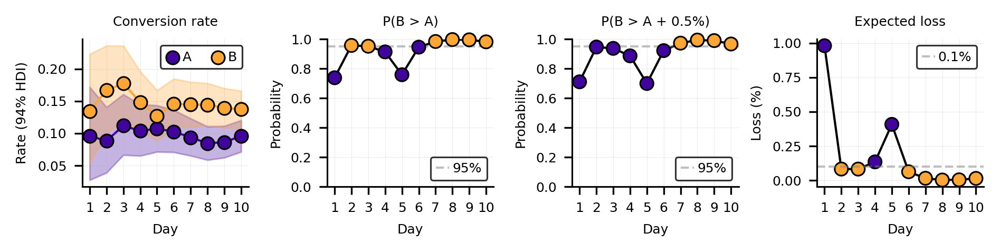

<p align="left">
  
</p>

# Bayesian A/B Testing

Flexible metrics for better decisions. A companion repository to the blog post.

📄 **[Read the post here](https://moltaire.github.io/bayesian-ab-testing)**

## Installation

```bash
uv sync
```

Or install as editable package:

```bash
uv pip install -e .
```

## Usage

```python
import src.bayesian_ab as bab

# Simulate A/B test data
data = bab.simulation.simulate_ab_test(
    n_days=10,
    daily_n=50,
    p_a=0.10,
    p_b=0.12,
    seed=1763,  # Year Bayes' theorem was published
)

# Run Bayesian sequential analysis
results = bab.bayesian.sequential_analysis(data, rope=0.005, seed=1763)

# Plot metrics over time
fig, axs = bab.bayesian.plot_sequential_metrics(results, rope=0.005)
```



## Project structure

```
.
├── index.ipynb              # Main notebook / blog post
├── src/bayesian_ab/         # Python package
│   ├── simulation.py        #   A/B test data simulation
│   ├── frequentist.py       #   Power analysis & z-tests
│   └── bayesian/            #   Bayesian analysis
│       ├── metrics.py       #     P(B>A), expected loss, ROPE, HDI
│       ├── conjugate.py     #     Beta-Binomial model
│       ├── plotting.py      #     Sequential metrics plot
│       └── models.py        #     PyMC model builders
└── tests/                   # pytest tests
```
